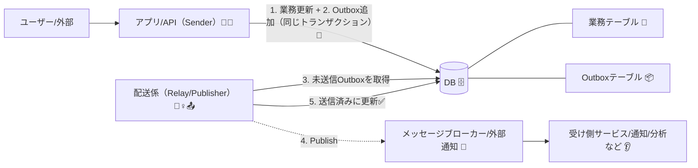
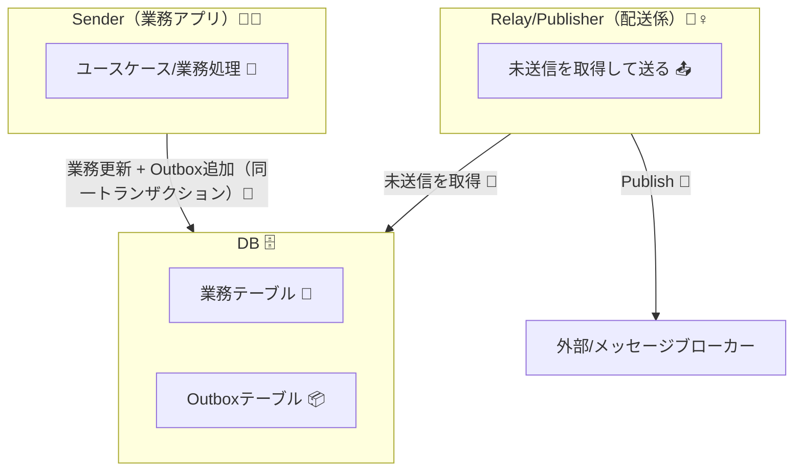
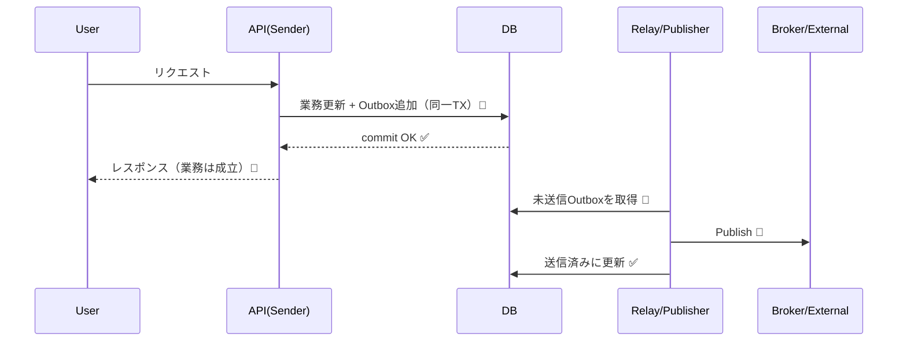

# 第6章：全体アーキ図を描こう（登場人物を整理）🗺️👥

## 6-1. まずは“登場人物”をそろえよう 📦🧾📤

Outboxを理解するコツは、**「誰が」「どこに」「何を置いて」「誰が運ぶか」**を先に固定することだよ〜🙂✨
Transactional Outboxの典型の登場人物は、だいたいこの4人セット👇（用語は文献でもほぼ同じ） ([microservices.io][1])

* **Sender（送る側サービス）** 🧑‍🍳📩
  例：注文サービス、会員サービスなど。業務処理の本体。
* **Database（業務DB）** 🗄️
  業務テーブルを保存する場所。
* **Message Outbox（Outbox置き場）** 📦🧾
  「送る予定のメッセージ」を入れる場所（RDBならOutboxテーブルが多い） ([microservices.io][1])
* **Message Relay / Publisher（配送係）** 🏃‍♀️📤
  Outboxを見て、メッセージブローカーや外部へ“運ぶ”係。 ([microservices.io][1])

---

## 6-2. “最小アーキ図”はこれだけでOK 🧩✨

「教材としてまず描ける」最小構成はこれ👇
（矢印＝データの流れ、点線＝非同期っぽい雰囲気）

ポイントはここ👇🙂

* Senderは **「業務の正しさ」** を守る担当 🧠✅
* 配送係は **「外に届ける」** 担当 🏃‍♀️📤
* 2つを分けることで、送信の失敗を業務処理から切り離せる ✂️🧯

---

## 6-3. 典型フロー（“更新 → Outbox → 後で送る”）🔁🕒

Outboxの流れは、ほぼこの順番で覚えれば勝ち🎯
（文献でもこの形が王道） ([microservices.io][1])

1. **リクエストが来る** 🧑‍💻➡️
2. **業務テーブルを更新する** 🧾✍️
3. **同じトランザクションでOutboxにも1行追加する** 📦🧾🔐

   * 「業務更新は成功したのに通知だけ失敗」みたいな事故を避けたいから！
4. **配送係がOutboxから未送信を拾う** 🏃‍♀️🔎
5. **外へPublishして、送信済みにする** ✅📤

「同じトランザクションでOutboxに保存してから配送する」ことで、**内部状態と外部イベントの不整合を避ける**のが狙いだよ🛡️ ([Debezium][2])

---

## 6-4. “後で送る”って、何がうれしいの？😇📨

“後で送る”の意味は、ただ遅らせることじゃなくて…

* **送信失敗を、業務の成功/失敗から切り離す** ✂️🧯
  送信が一時的に落ちても、業務（注文確定など）は成立できる。
* **再送（リトライ）できる** 🔁
  「Outboxに残ってる＝まだ送れてない」が見える。
* **確実な配信（少なくとも一度）に寄せやすい** 📮
  ただし、その代わり **二重送信は起こり得る** → だから後の章で冪等性が大事になるよ🛡️🔑（ここ超重要！） ([Microsoft Learn][3])

---

## 6-5. 配送係（Relay/Publisher）の実装パターンは2択 🥢

配送係がOutboxを見つける方法は、よくあるのがこの2つ👇

### A) ポーリング（定期的にDBを見に行く）⏱️🔎

* 例：「1秒ごとに未送信をSELECTして送る」
* シンプルで教材向き🙂✨
* 欠点：頻繁にDBを見に行くので、負荷と遅延の調整が必要

### B) CDC（変更データキャプチャ）で“DBの変更”を拾う 🧲🛰️

* DBの更新ログ/変更フィードからOutboxの追加を検知して送るイメージ
* Debezium は、Outboxテーブルの変更をキャプチャしてイベントに流す方式を公式に案内してるよ ([Debezium][2])
* Microsoft の設計ガイドでも、Cosmos DBの変更フィード等を使ってOutboxを処理する例がまとまってるよ ([Microsoft Learn][3])

教材ではまず **A) ポーリング** で理解して、余裕が出たら **B) CDC** に進むのがやさしいよ〜🙂🪜

---

## 6-6. “図に描くべき線”チェックリスト ✅🖊️

アーキ図って、箱を並べるだけだと「ふわっ」ってしがち🥺
だから、最低でもこの線を描くと一気に強くなるよ💪✨

* **トランザクション境界 🔐**
  「業務更新＋Outbox追加」が同じ枠だと一目で分かるようにする
* **同期/非同期の境界 ⏳**
  APIの返答までに含める処理と、後でやる処理を分ける
* **責務（SoC）✂️**
  Senderは業務、配送係は配送。混ぜない！
* **状態遷移（最低限）🚦**
  Outboxが「未送信 → 送信中 → 送信済/失敗」みたいに動くことが想像できる

---

## 6-7. 10分ミニ演習：アーキ図をドキュメントに貼ろう 📝✨

学習用に、`docs/architecture.md` を作って、Mermaidで貼るとすごくラクだよ〜🙂🩷

### ① 全体図（コンポーネント図）🗺️

### ② シーケンス図（流れの時間順）⏱️

これが描けたら、Outboxの全体像はもう“地図”を持ってる状態だよ🗺️✨

---

## 6-8. AIに手伝ってもらうコツ（そのままコピペOK）🤖🪄

### アーキ図を整えるプロンプト 🧩

* 「Transactional Outboxの最小構成を、Sender/DB/Outbox/Relay/Broker/Consumerの6要素で、Mermaidのflowchartで描いて。トランザクション境界と非同期境界も分かるようにコメント入れて」

### “責務混ざってない？”チェック 🕵️‍♀️

* 「この構成で、Senderに配送責務が混ざる“事故例”を3つ挙げて。どう分離すべきかも教えて」

### 例外と失敗の洗い出し 🧯

* 「Outbox方式で起こり得る失敗（DB成功/送信失敗/二重送信/配送係停止など）を列挙して、どのコンポーネントが面倒を見るべきか分類して」

---

## 6-9. ちいさな理解チェック（3問）🧠✅

1. Outboxに入れるのは「送った結果」？それとも「送る予定」？📦
2. Senderが業務更新に成功したあと、配送係が止まっても何が残る？🧾
3. Outboxで「少なくとも一度」を狙うと、別の問題が出る。それは何？🔁🛡️

---

## 参考にした定番の整理（読みやすいところ）📚✨

* microservices.io のTransactional Outbox（登場人物とMessage Relayの説明がスッキリ） ([microservices.io][1])
* Azure Architecture Center のTransactional Outbox解説（確実な配信や処理パイプライン例） ([Microsoft Learn][3])
* OutboxとCDC（Outboxテーブルの変更を拾う考え方） ([Debezium][2])
* 「同一トランザクションでOutboxへ保存→配送係が処理」の定番説明（噛み砕き） ([DEV Community][4])

[1]: https://microservices.io/patterns/data/transactional-outbox.html?utm_source=chatgpt.com "Pattern: Transactional outbox"
[2]: https://debezium.io/documentation/reference/stable/transformations/outbox-event-router.html?utm_source=chatgpt.com "Outbox Event Router"
[3]: https://learn.microsoft.com/en-us/azure/architecture/databases/guide/transactional-outbox-cosmos?utm_source=chatgpt.com "Transactional Outbox pattern with Azure Cosmos DB"
[4]: https://dev.to/stevsharp/reliable-messaging-in-net-domain-events-and-the-outbox-pattern-with-ef-core-interceptors-pjp?utm_source=chatgpt.com "Domain Events and the Outbox Pattern with EF Core ..."
